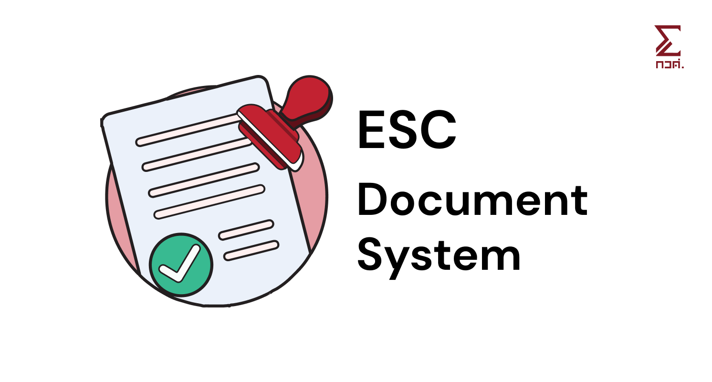

# ESC Project Tracker

Document generator tool to facilitate internal document process in ESC organization (especially for secretary).



## Features

- [x] Generate document from template
- [x] Generate document from .toml file
- [ ] Fetch data from a database

## Document Types

- [x] (1) Location Permit
- [ ] (0) Project Proposal
- [ ] (3) Sponsorship Request
- [ ] (6) Event Report
- [ ] (7) Financial Report
- [ ] (8) Money Request
- [ ] (AT) Attendance List

## Setup

Make sure you have [Node.js](https://nodejs.org/en/) and [pnpm](https://pnpm.io/) installed.

1. Clone this repository

```bash
git clone https://github.com/esc-chula/esc-project-tracker.git
```

2. Install dependencies

```bash
pnpm install
```

3. Run the app

```bash
pnpm start
```
